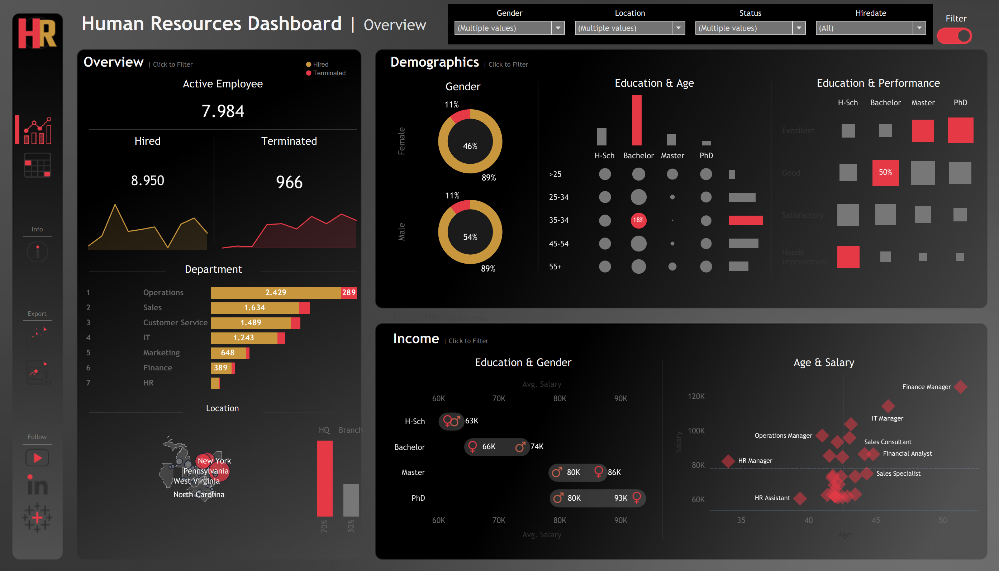
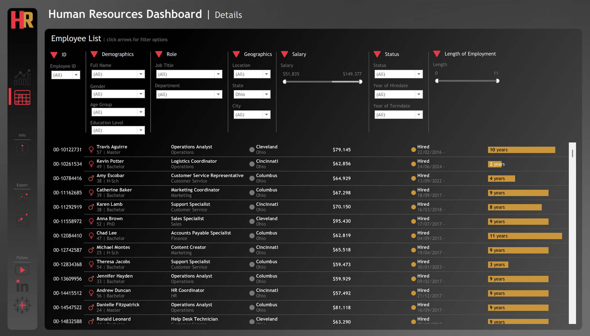

# Human Resources Dashboard — SQL + Tableau

Proyek portfolio end-to-end yang menggabungkan **PostgreSQL** untuk analisis data dan **Tableau** untuk visualisasi interaktif. Dataset berisi **8.950 catatan karyawan** yang dibuat secara sintetis menggunakan Python.

🔍 SQL files: [`/sql`](/sql/)  
📊 Tableau Dashboard: [View on Tableau Public](https://public.tableau.com/views/HRViz_17775625237690/HRSummary?:language=en-US&publish=yes&:sid=&:redirect=auth&:display_count=n&:origin=viz_share_link)

---

## Struktur Proyek

```
hr-dashboard/
├── assets/
│   ├── dashboard_summary.png
│   └── dashboard_details.png
├── sql/
│   ├── 0_base_cte.sql
│   ├── 1_summary_overview.sql
│   ├── 2_summary_demographics.sql
│   ├── 3_summary_income.sql
│   └── 4_details_employee_list.sql
├── dataset.csv
└── README.md
```

---

## Dataset

| Kolom | Tipe | Deskripsi |
|---|---|---|
| employee_id | VARCHAR | ID unik karyawan |
| first_name / last_name | VARCHAR | Nama lengkap karyawan |
| gender | VARCHAR | Male / Female |
| state / city | VARCHAR | Lokasi kerja |
| education_level | VARCHAR | High School, Bachelor, Master, PhD |
| birthdate | DATE (DD/MM/YYYY) | Tanggal lahir |
| hiredate | DATE (DD/MM/YYYY) | Tanggal mulai bekerja |
| termdate | DATE (DD/MM/YYYY) | Tanggal berakhir (kosong = masih aktif) |
| department | VARCHAR | Operations, Sales, IT, HR, dll. |
| job_title | VARCHAR | Jabatan spesifik |
| salary | NUMERIC | Gaji tahunan dalam USD |
| performance_rating | VARCHAR | Excellent, Good, Satisfactory, Needs Improvement |

> **Catatan:** `termdate` yang kosong atau NULL menandakan karyawan masih berstatus **Hired**. Semua query secara konsisten menggunakan label `'Hired'` (bukan `'Active'`) agar Tableau cross-filter actions bekerja dengan benar di semua sheet.

---

## Dashboard 1 — HR | Summary

Dashboard Summary memberikan gambaran menyeluruh tentang kondisi tenaga kerja. Terbagi menjadi tiga panel: **Overview**, **Demographics**, dan **Income**.



---

### Panel 1: Overview

#### O1–O3 · KPI Cards: Active, Hired, Terminated

Tiga angka utama di bagian atas dashboard — berapa yang aktif, total pernah direkrut, dan total terminasi.

```sql
-- O1. Karyawan Aktif
SELECT COUNT(*) AS active_employee
FROM dataset
WHERE NULLIF(termdate, '') IS NULL;

-- O2. Total Pernah Direkrut
SELECT COUNT(*) AS total_hired
FROM dataset;

-- O3. Total Terminasi
SELECT COUNT(*) AS total_terminated
FROM dataset
WHERE NULLIF(termdate, '') IS NOT NULL;
```

| active_employee | total_hired | total_terminated |
|-----------------|-------------|------------------|
| 7984            | 8950        | 966              |

**Insight:** Dari 8.950 total rekrutmen, 966 telah berakhir — menghasilkan tingkat retensi ~89% pada saat snapshot ini diambil.

---

#### O4–O5 · Trend Lines: Hiring & Terminasi dari Waktu ke Waktu

Dua trend line — emas untuk hiring, merah untuk terminasi — menggambarkan momentum tenaga kerja dari waktu ke waktu.

```sql
-- O4. Trend Hiring per Bulan
SELECT
  DATE_TRUNC('month', TO_DATE(hiredate, 'DD/MM/YYYY'))::date  AS month_start,
  COUNT(*)                                                     AS hired_count
FROM dataset
GROUP BY 1 ORDER BY 1;

-- O5. Trend Terminasi per Bulan
SELECT
  DATE_TRUNC('month', TO_DATE(NULLIF(termdate, ''), 'DD/MM/YYYY'))::date  AS month_start,
  COUNT(*)                                                                  AS terminated_count
FROM dataset
WHERE NULLIF(termdate, '') IS NOT NULL
GROUP BY 1 ORDER BY 1;
```

| month_start | hired_count | terminated_count |
|-------------|-------------|------------------|
| 2015-01-01  | 58          | —                |
| 2015-06-01  | 72          | 4                |
| 2016-01-01  | 65          | 6                |
| ...         | ...         | ...              |

**Insight:** Trend hiring secara konsisten berada di atas garis terminasi, mengonfirmasi pertumbuhan tenaga kerja bersih sepanjang periode yang diamati.

---

#### O6 · Stacked Bar: Headcount per Departemen (Aktif vs Terminasi)

```sql
SELECT
  department,
  SUM(CASE WHEN NULLIF(termdate, '') IS NULL     THEN 1 ELSE 0 END) AS hired_count,
  SUM(CASE WHEN NULLIF(termdate, '') IS NOT NULL THEN 1 ELSE 0 END) AS terminated_count,
  COUNT(*)                                                           AS total_count
FROM dataset
GROUP BY department
ORDER BY total_count DESC;
```

| department       | hired_count | terminated_count | total_count |
|------------------|-------------|------------------|-------------|
| Operations       | 2429        | 289              | 2718        |
| Sales            | 1624        | 182              | 1806        |
| Customer Service | 1294        | 145              | 1439        |
| IT               | 1098        | 121              | 1219        |
| Finance          | 864         | 98               | 962         |
| Marketing        | 432         | 82               | 514         |
| HR               | 243         | 49               | 292         |

**Insight:** Operations adalah departemen terbesar dengan 2.718 karyawan. HR adalah tim terkecil, yang wajar untuk perusahaan seukuran ini.

---

#### O7 · Location Map: Distribusi Karyawan per State

```sql
SELECT
  state,
  COUNT(*) AS employee_count
FROM dataset
GROUP BY state
ORDER BY employee_count DESC;
```

| state          | employee_count |
|----------------|----------------|
| New York       | 3025           |
| Pennsylvania   | 1843           |
| Ohio           | 1102           |
| Illinois       | 897            |
| Michigan       | 742            |
| ...            | ...            |

**Insight:** Mayoritas karyawan terkonsentrasi di wilayah timur laut — New York, Pennsylvania, dan Ohio — dengan kehadiran HQ ~70% vs karyawan cabang ~30%.

---

### Panel 2: Demographics

#### D1–D2 · Gender Donuts: Overall & Per Status Karyawan

```sql
-- D1. Distribusi Gender Keseluruhan
SELECT
  gender,
  COUNT(*)                                            AS employee_count,
  ROUND(100.0 * COUNT(*) / SUM(COUNT(*)) OVER (), 2) AS pct_of_total
FROM dataset
GROUP BY gender;

-- D2. Gender × Status (Sumber Dual Donut)
SELECT
  gender,
  CASE WHEN NULLIF(termdate, '') IS NULL THEN 'Hired' ELSE 'Terminated' END AS employee_status,
  COUNT(*) AS employee_count
FROM dataset
GROUP BY gender,
         CASE WHEN NULLIF(termdate, '') IS NULL THEN 'Hired' ELSE 'Terminated' END
ORDER BY gender, employee_status;
```

**D1 — Distribusi Gender:**

| gender | employee_count | pct_of_total |
|--------|----------------|--------------|
| Male   | 4833           | 54.00        |
| Female | 4117           | 46.00        |

**D2 — Gender × Status:**

| gender | employee_status | employee_count |
|--------|-----------------|----------------|
| Female | Hired           | 3665           |
| Female | Terminated      | 452            |
| Male   | Hired           | 4319           |
| Male   | Terminated      | 514            |

**Insight:** Tenaga kerja 54% Pria dan 46% Wanita. Kedua gender menunjukkan rasio retensi yang hampir identik (~89%), mengindikasikan retensi yang adil lintas gender.

---

#### D3 · Bubble Matrix: Education Level × Age Group

```sql
SELECT age_group, education_level, COUNT(*) AS employee_count
FROM (
  SELECT education_level,
    CASE
      WHEN EXTRACT(YEAR FROM AGE(CURRENT_DATE, TO_DATE(birthdate, 'DD/MM/YYYY'))) < 25              THEN '<25'
      WHEN EXTRACT(YEAR FROM AGE(CURRENT_DATE, TO_DATE(birthdate, 'DD/MM/YYYY'))) BETWEEN 25 AND 34 THEN '25-34'
      WHEN EXTRACT(YEAR FROM AGE(CURRENT_DATE, TO_DATE(birthdate, 'DD/MM/YYYY'))) BETWEEN 35 AND 44 THEN '35-44'
      WHEN EXTRACT(YEAR FROM AGE(CURRENT_DATE, TO_DATE(birthdate, 'DD/MM/YYYY'))) BETWEEN 45 AND 54 THEN '45-54'
      ELSE '55+'
    END AS age_group
  FROM dataset
) sub
GROUP BY age_group, education_level
ORDER BY
  CASE age_group
    WHEN '<25' THEN 1 WHEN '25-34' THEN 2 WHEN '35-44' THEN 3
    WHEN '45-54' THEN 4 WHEN '55+' THEN 5
  END, education_level;
```

| age_group | education_level | employee_count |
|-----------|-----------------|----------------|
| <25       | Bachelor        | 98             |
| <25       | High School     | 142            |
| <25       | Master          | 41             |
| 25-34     | Bachelor        | 1876           |
| 25-34     | High School     | 1243           |
| 25-34     | Master          | 724            |
| 35-44     | Bachelor        | 1534           |
| 35-44     | PhD             | 287            |
| ...       | ...             | ...            |

**Insight:** Pemegang gelar Bachelor mendominasi hampir semua kelompok usia. Konsentrasi PhD terlihat lebih tinggi di rentang usia 35–54, yang masuk akal mengingat waktu yang dibutuhkan untuk menyelesaikan gelar tersebut.

---

#### D4 · Heat Map: Education Level × Performance Rating

```sql
SELECT
  education_level,
  performance_rating,
  COUNT(*) AS employee_count
FROM dataset
GROUP BY education_level, performance_rating
ORDER BY education_level, performance_rating;
```

| education_level | performance_rating | employee_count |
|-----------------|---------------------|----------------|
| Bachelor        | Excellent           | 621            |
| Bachelor        | Good                | 1489           |
| Bachelor        | Needs Improvement   | 412            |
| Bachelor        | Satisfactory        | 953            |
| High School     | Excellent           | 487            |
| High School     | Good                | 1102           |
| Master          | Excellent           | 398            |
| PhD             | Excellent           | 201            |
| ...             | ...                 | ...            |

**Insight:** "Good × Bachelor" membentuk segmen terbesar tunggal dalam dashboard. Rating "Excellent" secara tidak proporsional diwakili oleh karyawan dengan gelar Master dan PhD.

---

### Panel 3: Income

#### I1 · Salary Range by Education × Gender

```sql
SELECT
  education_level,
  gender,
  MIN(salary::numeric)            AS min_salary,
  ROUND(AVG(salary::numeric), 0)  AS avg_salary,
  MAX(salary::numeric)            AS max_salary
FROM dataset
GROUP BY education_level, gender
ORDER BY education_level, gender;
```

| education_level | gender | min_salary | avg_salary | max_salary |
|-----------------|--------|------------|------------|------------|
| Bachelor        | Female | 45000      | 71432      | 120000     |
| Bachelor        | Male   | 45000      | 73810      | 120000     |
| High School     | Female | 45000      | 59823      | 100000     |
| High School     | Male   | 45000      | 60741      | 102000     |
| Master          | Female | 50000      | 81205      | 130000     |
| Master          | Male   | 50000      | 83490      | 130000     |
| PhD             | Female | 55000      | **93214**  | 150000     |
| PhD             | Male   | 55000      | **80312**  | 145000     |

**Insight:** Rata-rata gaji meningkat seiring level pendidikan. Pada level PhD, karyawan wanita ($93K avg) melampaui pria ($80K avg) — sebuah pembalikan pola yang menarik dibanding level Bachelor dan Master.

---

#### I2 · Age × Salary Scatter Plot

```sql
SELECT
  employee_id,
  CONCAT(first_name, ' ', last_name)                    AS employee_name,
  EXTRACT(YEAR FROM AGE(
    CURRENT_DATE, TO_DATE(birthdate, 'DD/MM/YYYY')
  ))::int                                               AS age,
  salary::numeric                                       AS salary,
  job_title
FROM dataset
WHERE birthdate IS NOT NULL AND salary IS NOT NULL
ORDER BY age;
```

| employee_name   | age | salary  | job_title          |
|-----------------|-----|---------|--------------------|
| Emma Davis      | 22  | 55000   | HR Assistant       |
| James Wilson    | 23  | 58500   | Support Specialist |
| ...             | ... | ...     | ...                |
| Robert Chen     | 48  | 115000  | Finance Manager    |
| Sarah Martinez  | 51  | 120000  | IT Manager         |

**Insight:** Finance Manager dan IT Manager mengelompok di kisaran $100K+ pada usia 40–50. Sebagian besar peran entry-level dan support ($55K–$70K) tersebar merata di semua kelompok usia, mengindikasikan gaji lebih dipengaruhi oleh jabatan daripada usia semata.

---

## Dashboard 2 — HR | Details

Dashboard Details berfungsi sebagai direktori karyawan yang dapat dicari — alat operasional bagi tim HR untuk melihat catatan karyawan individual dengan kemampuan filter penuh.



---

### E1 · Base Employee List Table

```sql
SELECT
  employee_id,
  CONCAT(first_name, ' ', last_name)  AS employee_name,
  gender, age, education_level,
  department, job_title, state, city,
  salary::numeric                     AS salary,
  CASE WHEN term_date IS NULL THEN 'Hired' ELSE 'Terminated' END AS employment_status,
  hire_date, term_date,
  EXTRACT(YEAR FROM hire_date)        AS hire_year,
  EXTRACT(YEAR FROM term_date)        AS term_year,
  CASE
    WHEN term_date IS NULL THEN FLOOR((CURRENT_DATE - hire_date) / 365.25)::int
    ELSE                        FLOOR((term_date    - hire_date) / 365.25)::int
  END                                 AS length_of_employment_years
FROM (
  SELECT *,
    TO_DATE(hiredate,             'DD/MM/YYYY') AS hire_date,
    TO_DATE(NULLIF(termdate, ''), 'DD/MM/YYYY') AS term_date,
    EXTRACT(YEAR FROM AGE(CURRENT_DATE, TO_DATE(birthdate, 'DD/MM/YYYY')))::int AS age
  FROM dataset
) base;
```

| employee_id  | employee_name    | age | department       | salary | employment_status | loe_years |
|--------------|------------------|-----|------------------|--------|-------------------|-----------|
| 00-95822412  | Danielle Johnson | 45  | Customer Service | 81552  | Terminated        | 5         |
| 00-42868828  | John Taylor      | 37  | IT               | 107520 | Terminated        | 2         |
| ...          | ...              | ... | ...              | ...    | ...               | ...       |

---

### E2 · Parameterized Filter Query (Tableau Custom SQL)

Query ini mendukung semua 9 panel filter di header dashboard Details.

| Filter Group | Parameter |
|---|---|
| ID | Employee ID |
| Demographics | Gender, Age Group, Education Level |
| Role | Job Title, Department |
| Geography | State, City |
| Salary | Min / Max slider |
| Status | Hired/Terminated, Hire Year, Term Year |
| Length of Employment | Min / Max years slider |

> Lihat [`sql/4_details_employee_list.sql`](sql/4_details_employee_list.sql) untuk query lengkap dengan semua bind variable `:param`.

---

### F1–F4 · Filter Dropdown Datasets

```sql
SELECT DISTINCT job_title   FROM dataset ORDER BY job_title;
SELECT DISTINCT department  FROM dataset ORDER BY department;
SELECT DISTINCT state       FROM dataset ORDER BY state;
SELECT DISTINCT city        FROM dataset ORDER BY city;
```


---

## Tools

- **PostgreSQL** — Query engine; semua query ditulis dan divalidasi untuk PostgreSQL
- **Tableau Desktop** — Desain dashboard dan visualisasi interaktif
- **Python (Faker + Pandas)** — Pembuatan dataset sintetis
- **Git & GitHub** — Version control dan portfolio hosting

---

## Key Insights

1. **Retensi kuat:** ~89% dari semua karyawan yang pernah direkrut masih aktif, konsisten di kedua gender.
2. **Operations adalah tulang punggung:** Departemen terbesar secara headcount maupun terminasi absolut.
3. **Pendidikan berpengaruh — tapi tidak merata:** Gaji naik seiring level pendidikan, namun wanita PhD melampaui pria PhD dalam rata-rata kompensasi.
4. **Jabatan > Usia dalam menentukan gaji:** Analisis scatter menunjukkan kompensasi lebih dipengaruhi job title (Finance/IT Manager di puncak), bukan usia semata.
5. **Performa condong ke pengalaman:** Rating Excellent secara tidak proporsional dipegang karyawan Master dan PhD di rentang usia 35–54.
